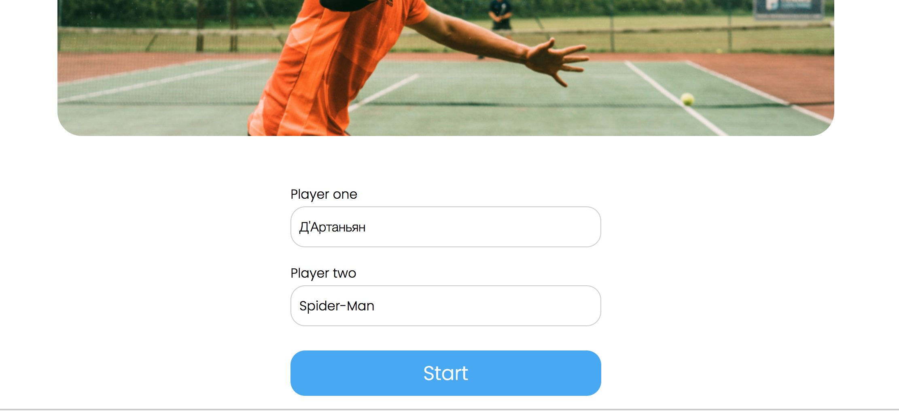
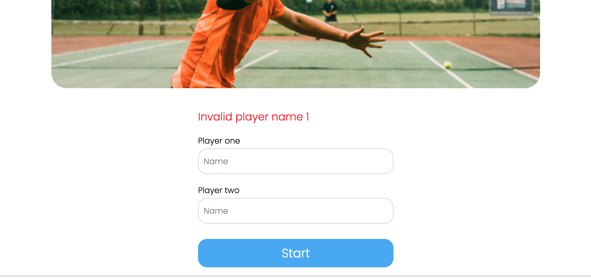
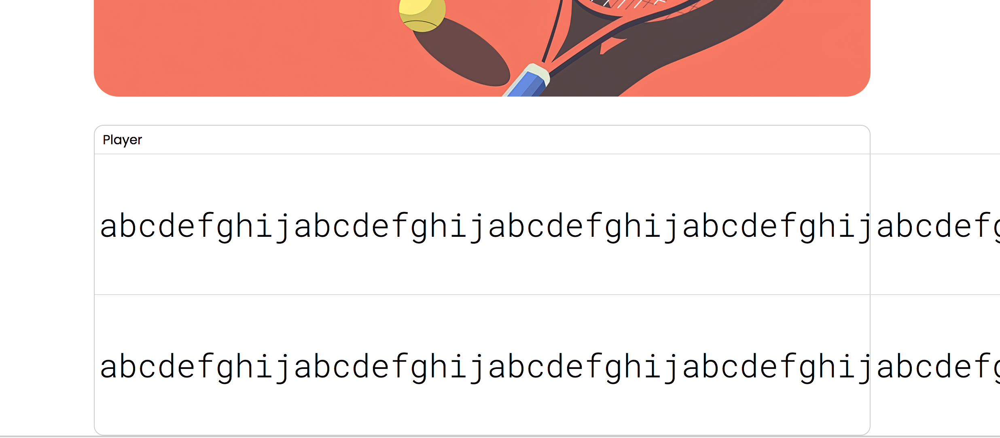
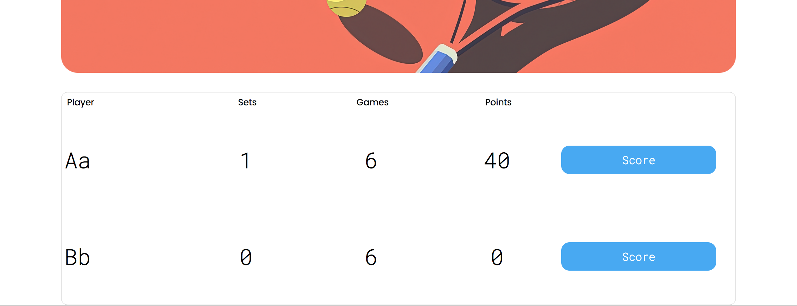
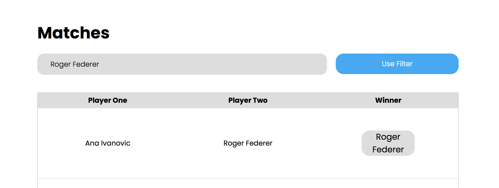
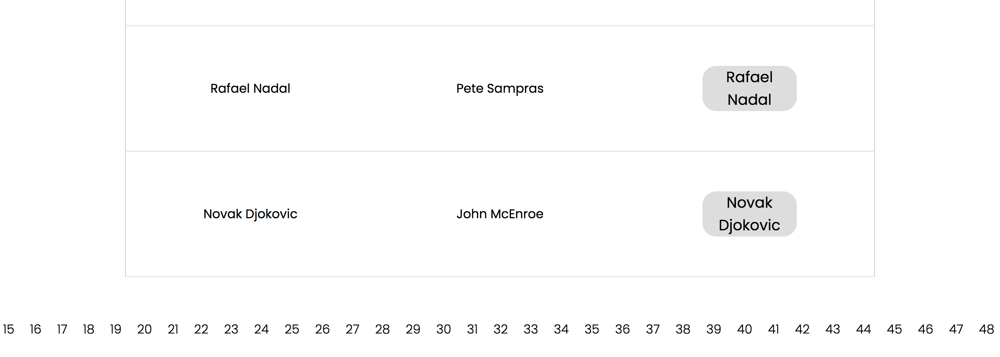

```text
Знаком ❗️ помечены критически важные замечания, а также места нарушения ТЗ.
```

## Функциональный обзор

- При использовании недопустимого имени, оно не сохраняется в поле ввода и приходится заново его печатать.





При ошибке лучше оставлять текст в поле ввода — это улучшит пользовательский опыт.

- Сообщение об ошибке описывает все правила валидации, но не сообщает, что именно сейчас не так. Лучше сообщать какое именно правило валидации сейчас нарушает имя.

- Длина имени ничем не ограничена, поэтому можно создать игроков с визуально бесконечными именами.



- При счёте 6-6 в сете должен начинаться так-брейк. Но сейчас продолжается счёт 15-30-40, как будто идёт ещё один гейм.


Затем при счёте 40-0 и выигрыше очка первым игроком счёт становится AD-40.




После этого два выигранных очка ничего не меняют и только после третьего очка выигрывается сет.

- Нет кнопки сброса фильтра по имени игрока.



После фильтрации матчей должна быть возможность вернуться к полному списку, сбросив фильтр. Сейчас это можно сделать обходным путём — если очистить поле ввода имени и нажать "Use Filter".

Лучше добавить специальную кнопку сброса фильтра.

- Кнопку применения фильтра по имени можно назвать "Apply Filter".

- ❗️В пагинации на странице завершённых матчей отображаются все страницы, что плохо выглядит при большом количестве страниц и делает недоступными страницы за пределами экрана.



Лучше сделать отображение текущей и +-2 страниц вокруг неё.

- Последний сыгранный матч отображается последним в списке на странице завершённых матчей — чтобы посмотреть его результат в таблице надо листать до последней страницы. Лучше, чтобы последний завершённый отображался первым в списке (на первой странице).

